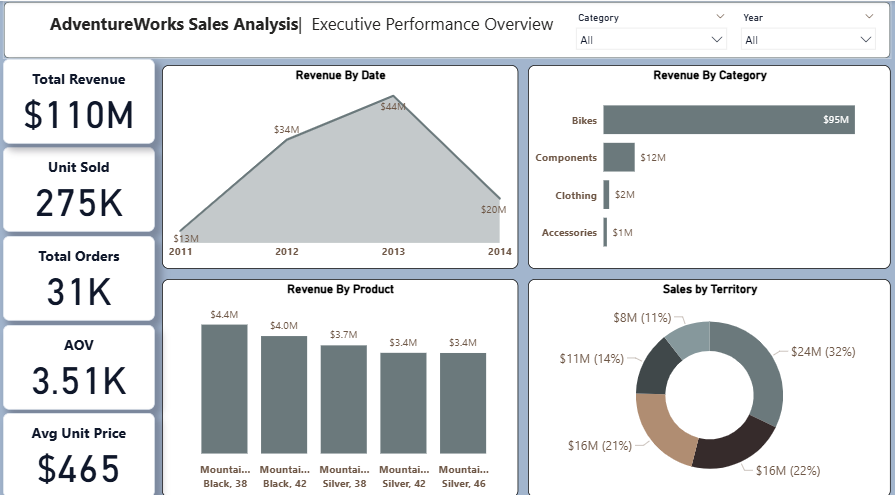
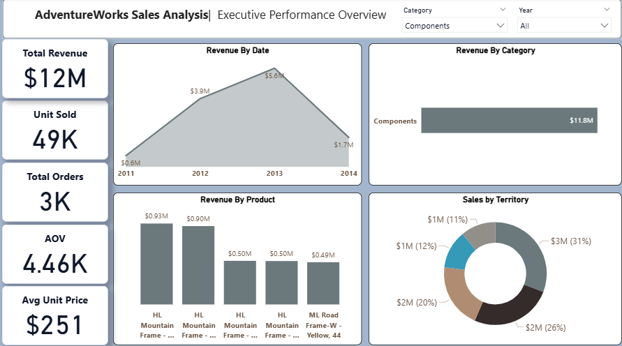
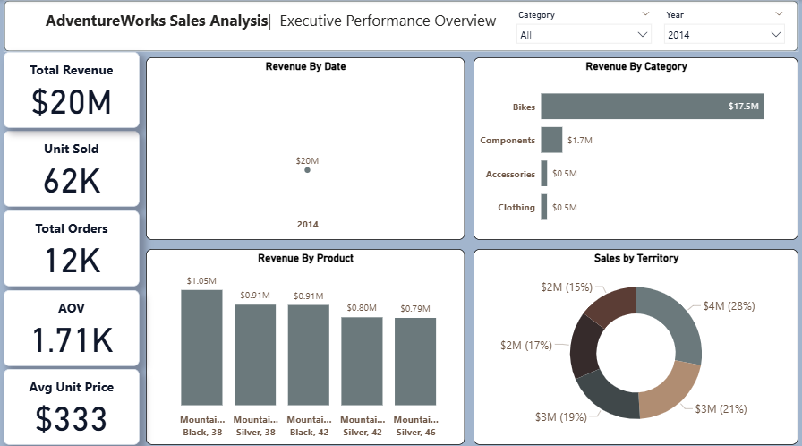

# AdventureWorks Sales Analysis

## Overview
Power BI dashboard analyzing sales performance, revenue trends, and key product metrics using the AdventureWorks dataset.

## Core Features & KPIs
- **Metrics Tracked:** Total Revenue ($110M), Units Sold (275K), Total Orders (31K), AOV ($3.51K), Avg Unit Price ($465).
- **Interactive Slicers:** Filter by Category and Year.
- **Visuals:** Revenue trends (2011–2014), Top 5 products, Category breakdown, Regional distribution.

---

## Dashboard Preview

### Overview

### Category Filter (Components)

### Year Filter (2014)

---

## Key DAX Measures

- Total Revenue:
  Total Revenue = SUMX(Fact_Sales, Fact_Sales[OrderQty] * Fact_Sales[UnitPrice])

- Total Orders:
  Total Orders = DISTINCTCOUNT(Fact_Sales[SalesOrderID])

- Units Sold:
  Unit Sold = SUM(Fact_Sales[OrderQty])

- Average Order Value:
  Average Order Value = DIVIDE([Total Revenue], [Total Orders], 0)

- Average Unit Price:
  Avg Unit Price = AVERAGE(Fact_Sales[UnitPrice])

---

## Main Takeaways
- **Bikes** generate $95M out of $110M total revenue (86%).
- Overall revenue peaked in **2013** at $44M.
- **Territory 1** is the top region with 32% ($24M) of overall sales.

---

## Tools Used
- Power BI Desktop
- DAX
